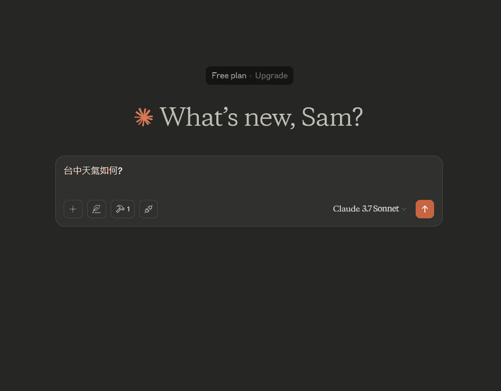
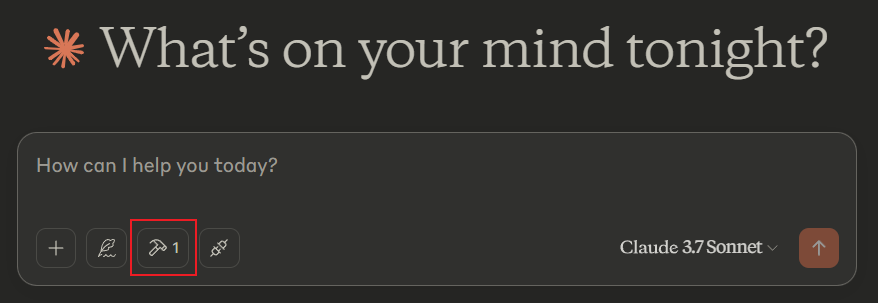
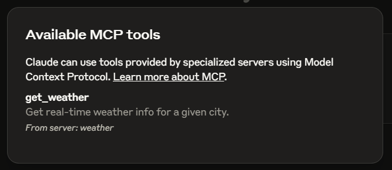
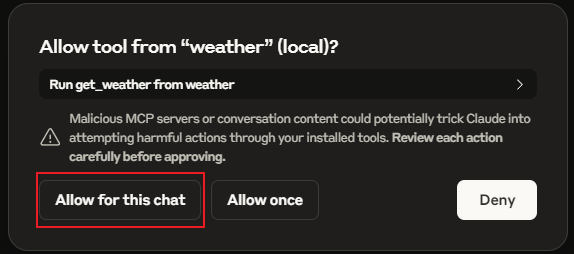

# ClaudeLocalMCP.js
自己為 Claude 寫本地端 MCP Server (JavaScript版) 很簡單，有手就行😁
完整流程 Demo 的 gif 圖檔  


# 簡介 MCP Server
MCP Server 就像「AI 的 USB 插槽」，讓 AI 能安全地連接外部資料或工具。  
舉例：AI 想查電腦檔案或查詢股票價格，MCP Server 就負責幫 AI 取得這些資料或執行操作。  
## AI 有了 MCP（模型上下文協定）後，將產生以下重大影響：
- AI 不再只是「建議者」，而能主動執行任務。例如，AI 不僅能告訴你怎麼查資料，還能直接幫你查詢資料庫、整理報表、發送郵件，甚至控制智慧家電  
- AI 可即時存取外部資料與工具，突破只能依賴訓練知識的限制，能根據最新數據做出回應，如即時天氣、最新財經資訊等  
- AI 回答更精確，能減少「幻覺」問題，因為可直接查證外部資料來源  
- 開發者只需一次整合 MCP，AI 就能連接多種工具和資料，開發效率大幅提升  
- 用戶資料安全性提升，因為存取權限可細緻控管，且多數操作在本地端執行  
總結：MCP 讓 AI 從只能「說」進化到能「做」，大幅擴展應用範圍與價值，推動 AI 進入真正的智能代理（AI Agent）時代  

## Weather MCP Server
這是用來給 Claude 查詢指定地區的天氣資訊

### 安裝與啟動

需要 Node.js 18.19 以上版本，建議使用仍受支援的 LTS 版本。

```powershell
npm ci
npm start
```

啟動前請依下節設定 `OPENWEATHERMAP_API_KEY`。預設讀取本專案根目錄的 `.env`，
不受啟動時的工作目錄影響；也可直接透過程序環境變數提供金鑰。
環境變數優先於 `.env`，缺少金鑰時會立即退出並在 stderr 顯示錯誤。

需要指定其他環境檔或開發時自動重啟：

```powershell
npm start -- "envPath=D:\config\weather.env"
npm run watch
```

明確指定的環境檔若不存在或無法讀取，啟動會失敗。路徑可包含空白與 `=`，
請將整個 `envPath=...` 參數放在引號內。

這是 stdio MCP Server，啟動後等待 MCP 客戶端傳入訊息，沒有網頁或 HTTP 連接埠。
Claude Desktop 設定仍使用下方的 `node` 指令；`npm start` 適合在終端機開發時使用。

### 申請天氣 API 服務
我去申請 https://openweathermap.org/ 的免費服務
請去註冊並取得 API 金鑰 (API Key)

### 在 .env 填入金鑰
```shell
OPENWEATHERMAP_API_KEY=你的實際API金鑰貼在這裡
```
記得在根目錄內放上 .env 檔案來提供 API金鑰

### 安裝 Claude 桌面版
https://claude.ai/download

### 開啟 Claude 開發模式
右上角 File => Settings
開啟 Developer 模式

### 設定 MCP Server 給 Claude 使用
Windows 用戶請  
開啟目錄 `C:\Users\使用者名稱\AppData\Roaming\Claude`  
檔案名稱 `claude_desktop_config.json`
```json
{
    "mcpServers": {
        "weather": {
            "command": "node",
            "args": [
                "D:\\github\\ClaudeLocalMCP.js\\index.js",
                "envPath=D:\\github\\ClaudeLocalMCP.js\\.env"
            ]
        }
    }
}
```
envPath 是指定 .env 的路徑；若使用專案根目錄的 `.env`，可以省略此參數。

### 查詢行為與錯誤處理

- `get_weather` 接受 `city` 字串，會去除首尾空白並拒絕空白城市。
- 英文城市直接查詢 OpenWeatherMap；含漢字的城市先使用 MyMemory 翻譯。
- 翻譯連線失敗、逾時、超過配額或回傳空白時，改用原城市查詢。
- 每次 HTTP 請求逾時為 10 秒；中文查詢有兩個依序執行的階段，總時間可能接近 20 秒。
- 客戶端取消請求時會中止進行中的 HTTP 請求，且不再啟動下一個階段。
- 天氣查詢失敗以 MCP `isError: true` 回傳，包含金鑰無效、城市不存在及逾時等情況。
- 成功結果保留 `city`、`temperature`（攝氏）、`condition`、`humidity`（百分比）、
  `wind_speed`（m/s）與 `country` 欄位，以 JSON 文字回傳。

Server 在本機執行，但城市查詢仍會傳給外部 API。診斷訊息使用 stderr；
請勿新增 `console.log` 到 Server，以免破壞 stdout 上的 MCP 訊息。

### 執行測試

```powershell
npm test
```

使用 Node 內建測試工具，涵蓋 MCP 握手、輸入驗證、翻譯降級、錯誤回傳、
HTTP 逾時／取消，以及獨立程序的預設設定、指定路徑與 watch 啟動。
測試使用模擬資料與本機 HTTP 服務，不讀取你的 `.env` 或呼叫真實天氣／翻譯 API。

確認一下 MCP 是否正常開啟  

檢視一下 MCP 名稱  

詢問時要指定地區，如: 台中天氣如何?  
Claude 會要你確認(Allow for this chat)是否可以執行 MCP 服務

### 查詢 MCP Server 執行 log
Windows 用戶請  
開啟目錄 `C:\Users\使用者名稱\AppData\Roaming\Claude\logs`
